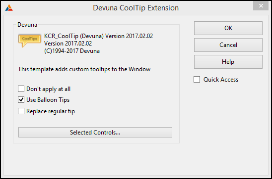
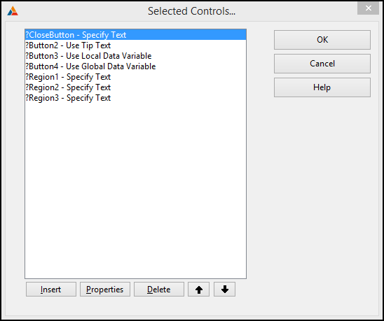
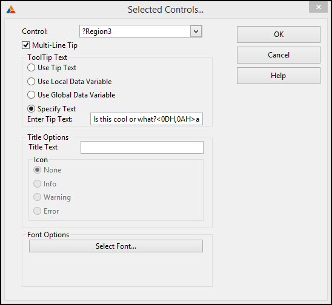

# CoolTips #

### CoolTips Templates are written in and for Clarion for Windows ###

## License ##
Distributed under [GPL 3.0](http://www.gnu.org/licenses/gpl-3.0.txt "GPL 3.0")

## Overview ##
CoolTips consists of a class wrapper for the Microsoft tooltip common control [comctl32.dll] which provides tooltips for the controls on a window. And, a template set to  make it easy to add balloon tooltips and tooltips on regions.

The **setup** folder contains the ***CoolTipsSetup.exe*** program for installing CoolTips for Clarion Version 10.  The **SetupBuilder** subfolder contains the [**SetupBuilder®**](http://www.lindersoft.com/products_setupbuilder_dev.htm) install project used to create ***CoolTipsSetup.exe***  

## Templates ##

There are two templates included in the CoolTips Template set:

1. KCR_GlobalCoolTips - *Application* EXTENSION template adds CoolTip to all procedures. This is not required, you may select each and every one procedure too. 
2. KCR_CoolTip - *Procedure* EXTENSION template to enable CoolTips for the procedure.

### KCR_CoolTip ###

Add the KCR_CoolTip extension to any window procedure to enable custom tooltips for the window.

### Screen Shots ###

##### [main property page] #####

##### [after pressing Selected Controls... button] #####

#### [after pressing the Properties button] ####

### Release Notes ###
1. 2017.02.02 Rebuild for Clarion 10.0.12463
2. 2015.03.05 Rebuild for Clarion 10
3. 2014.10.24 removed erroneous blank lines reported by Diego Borojovich from Softvelocity
4. 2009.05.23 fixed generation of include statement
5. 2005.09.20 Added template support for Titles and Font
6. Clarion 7.0 - Modified to support LANSRAD TipLink Template (www.lansrad.com). Put conditional code in INIT to allow TipLink to set tip type during initialization. If tipLink is not present, the conditional code is ignored.

## ToolTipClass ##

The ToolTipClass is defined by two files located in the libsrc/win folder.

- CoolTips.inc&nbsp;&nbsp;&nbsp;contains the ToolTip Class declaration.
- CoolTips.clw&nbsp;&nbsp;&nbsp;contains the ToolTip Class implementation.

Documentation for the ToolTipClass can be found in the Help folder of the repository.  The Help folder contains everything needed to build an HTML_Help file for the ToolTipClass.

You can read all [**About Tooltip Controls**](https://msdn.microsoft.com/en-us/library/windows/desktop/bb760250(v=vs.85).aspx) on the Microsoft msdn website.

## Example Application ##
The example application is normally installed in 

> CSIDL\_COMMON_DOCUMENTS\SoftVelocity\Clarion10\Accessory\Devuna\Examples\CoolTips